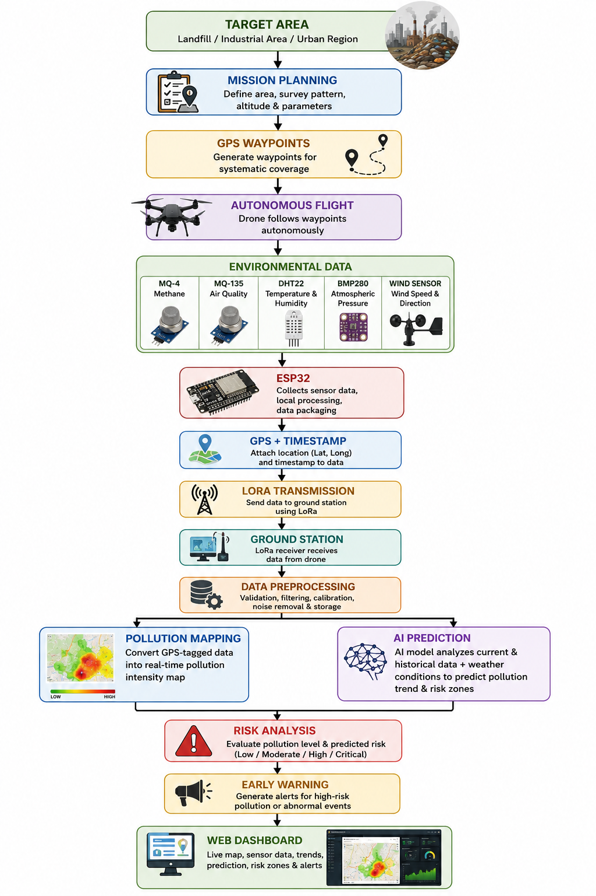

# 🚁 Environmental Intelligence Drone (EID)

<div align="center">
  
</div>

<div align="center">


</div>

## 🌍 Project Overview

**Environmental Intelligence Drone (EID)** is a drone-based environmental monitoring prototype that combines:

- 🌡️ Multi-sensor data collection (MQ-4, MQ-135, DHT22, BMP280)
- 📍 GPS geo-tagging of each reading
- 📡 LoRa telemetry to a ground receiver
- 🗺️ Web dashboards for visualization and analysis
- 🤖 AI-ready workflow for forecasting and alerting

The goal is to move from static monitoring points to **mobile, spatial, and proactive environmental intelligence**.

---

## 🎯 What Problem It Solves

Traditional fixed stations capture data at limited points.  
EID helps answer:

> **Where is pollution now, how is it changing, and where might risk move next?**

---

## ✨ Core Capabilities

- **Sense**: Collect live environmental readings onboard the drone
- **Locate**: Attach GPS coordinates and timing context
- **Transmit**: Send packets using LoRa to the ground station
- **Visualize**: Display maps, trends, and system status in web UI
- **Predict (future-ready)**: Use historical + spatial data for AI forecasts
- **Warn (future-ready)**: Trigger alerts when risk thresholds are crossed

---

## 🧩 Project Structure (Analyzed)

```text
Environmental-intelligence-Drone/
├── Drone website/                    # Main web app (React + TypeScript + Firebase support)
│   ├── src/components/               # UI components (dashboard, map, alerts, chat)
│   ├── src/pages/                    # Application pages
│   ├── src/context/                  # Auth + simulation contexts
│   ├── src/lib/firebase.ts           # Firebase integration
│   ├── server.ts                     # Local server entry
│   └── package.json
├── Drone2 website/                   # Alternate web app variant (React + TypeScript)
│   ├── src/components/               # Shared dashboard/map/layout style components
│   ├── src/pages/                    # Full page set
│   ├── src/context/SimulationContext.tsx
│   ├── server.ts
│   └── package.json
├── Hardware/
│   ├── ardunio/
│   │   ├── env_node/EID_Environmental_Node.ino   # ESP32 environmental node firmware
│   │   └── lora_receiver/lora_receiver.ino       # Ground-station LoRa receiver firmware
│   └── Hardware/Circuit_diagram/README.md        # Circuit documentation placeholder
├── Block-Diagram.png
├── EID_Project_Charter final.docx
├── Product requirement document.pdf
└── Environmental Intelligence Drone (EID).pptx
```

---

## 🧪 Hardware Stack

| Component | Role |
|---|---|
| ESP32 | Sensor data acquisition + preprocessing |
| MQ-4 | Methane/gas raw signal |
| MQ-135 | Air-quality-related raw signal |
| DHT22 | Temperature & humidity |
| BMP280 | Atmospheric pressure |
| GPS Module | Latitude/longitude tagging |
| LoRa Module | Long-range telemetry link |

> ⚠️ **Important:** MQ sensor values in current firmware are raw ADC readings and require calibration for quantitative environmental claims.

---

## 🌐 Run the Web Apps Locally

### 1) Main Web App (`Drone website`)

```bash
cd "Drone website"
npm install
npm run dev
```

### 2) Alternate Web App (`Drone2 website`)

```bash
cd "Drone2 website"
npm install
npm run dev
```

Both apps also include:

- `npm run lint` (TypeScript checks)
- `npm run build` (production build)

---

## 🔌 Firmware Notes

Arduino sketches are located in:

- `Hardware/ardunio/env_node/EID_Environmental_Node.ino`
- `Hardware/ardunio/lora_receiver/lora_receiver.ino`

Current firmware setup includes ESP32 pin mapping, sensor reads, GPS parsing, packet framing, and LoRa transmit/receive flow.

---

## 🚀 Roadmap Direction

- Better calibrated gas sensing pipeline
- Real-time backend ingestion and storage
- Pollution heatmaps and geospatial analytics
- AI forecasting and risk-based alert automation
- Mission planning and drone autonomy enhancements

---

## 👥 Team

**Team Nirvana**  
Environmental Intelligence Drone (EID)

